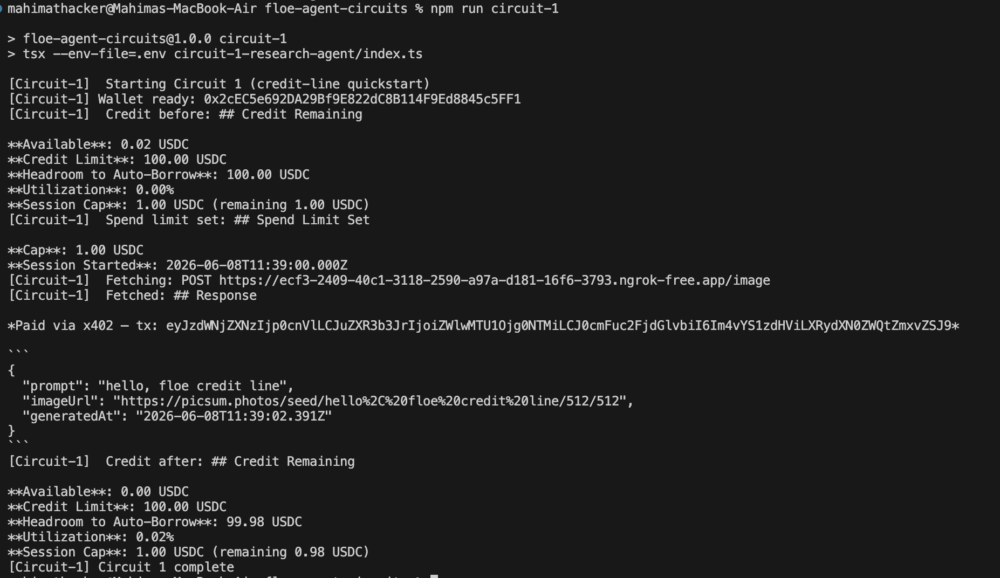
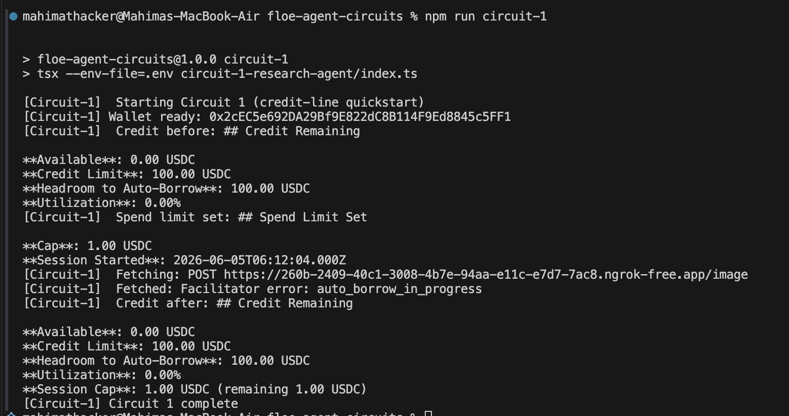
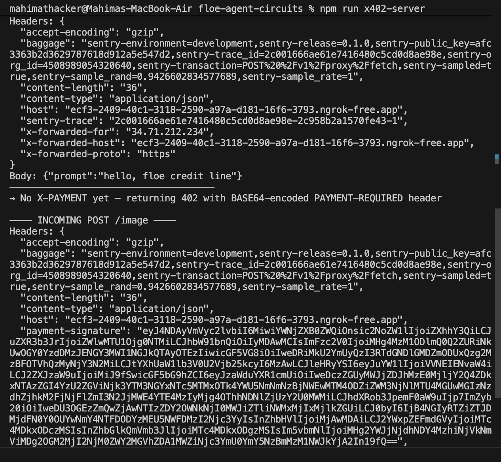

# Circuit 1 — Credit-Line Quickstart

The simplest possible Floe demo: an agent uses its Floe credit line to make one x402-paid call. No manual loan, no collateral upkeep, no gas — just the headline product flow.

## Current state

| Step | Status |
|---|---|
| Create agent → mint API key → read credit state | ✅ Works (`npm run circuit-1:awareness`) |
| Set spend limit | ✅ Works |
| Make a paid x402 call against my own stub | ✅ Works end-to-end (`npm run circuit-1`) |

First real end-to-end x402 round trip through Floe completed on 2026-06-08 — agent's `Available` dropped from $0.02 to $0.00 and Floe credited the $0.02 to my payTo wallet on Base mainnet. Output saved at [results/quickstart-2026-06-08.json](results/quickstart-2026-06-08.json).



This took a lot of iteration to get there. The journey is documented across Findings #11, #13, #14, #18, #19, #20, #21 in [docs/FINDINGS.md](../docs/FINDINGS.md). Several of those (#14, #18) have been resolved by Floe since I filed them.

## Files

| File | What it is |
|---|---|
| [index.ts](index.ts) | **Main**. Credit-line quickstart. ~5 SDK calls. |
| [awareness-smoke.ts](awareness-smoke.ts) | Read-only probe of credit state. No spending. Useful for checking the agent + key are set up before burning anything. |
| [agent.ts](agent.ts) | Shared research-loop helper used by the loan-SDK variant. |
| [index.loan-rest.ts](index.loan-rest.ts) | Power-user manual-loan flow via REST `/v1/credit/instant-borrow`. Older path, kept for reference. |
| [index.loan-sdk.ts](index.loan-sdk.ts) | Power-user manual-loan flow via SDK `manual_match_credit`. Needs ETH + WETH on the CDP wallet. |

## How to run

### Prerequisites

1. Create an Agent at [dev-dashboard.floelabs.xyz/agents](https://dev-dashboard.floelabs.xyz/agents). Note its borrow limit and the API key (only shown once).

   

2. Put the API key in `.env` as `FLOE_AGENT_API_KEY`.
3. Fund the agent's wallet with at least a few cents of USDC on Base mainnet so the credit line has something to borrow against. The dashboard has a "Buy with card" option, or send USDC directly on-chain.
4. Wait for the working capital line to match an on-chain lender (see Finding #19 — can take a few minutes to a few hours). Run the awareness probe to confirm `Available > 0` before making paid calls. While the line is opening you'll see something like this:

   

### Awareness probe (free, no spend)

```bash
npm run circuit-1:awareness
```

Returns the agent's credit limit, available balance, utilization, and any registered thresholds. Useful for verifying everything is set up before spending USDC.

Sample saved output: [results/awareness-2026-06-08.json](results/awareness-2026-06-08.json).

### Paid quickstart (the main demo)

Two terminals:

```bash
# Terminal 1 — start the local x402-paid stub
npm run x402-server

# Terminal 2 — expose it via ngrok so Floe's facilitator can reach it
ngrok http 8787
# copy the public URL and set X402_FETCH_URL in .env
# e.g. X402_FETCH_URL=https://<random>.ngrok-free.app/image

# Terminal 3 — run the agent
npm run circuit-1
```

What you should see:
- Agent reads `Credit before` showing what's available.
- Agent sets a session spend limit.
- Agent calls `x402_fetch` against the stub URL. Floe's facilitator parses the stub's 402, signs the payment via EIP-3009, retries with `PAYMENT-SIGNATURE`, and the stub returns the data with a `PAYMENT-RESPONSE` ack.
- `Credit after` reflects the $0.02 spend.
- Result saved to `results/quickstart-{date}.json`.

You can also point `X402_FETCH_URL` at any working endpoint in [Floe's x402 directory](https://floe-labs.gitbook.io/docs/developers/x402-directory) (Exa Contents, Exa Search, Tavily Search all worked for me in testing). The local stub is mainly there to demonstrate I understand both sides of the protocol — I wrote the merchant side too (see [x402-image-stub/](../x402-image-stub/)). Logs from the stub during a successful round trip:



### Power-user manual-loan variants

These open an explicit USDC loan against WETH collateral and require ETH for gas + WETH for collateral on the CDP wallet:

```bash
npm run circuit-1:loan-rest   # REST baseline via /v1/credit/instant-borrow
npm run circuit-1:loan-sdk    # SDK via manual_match_credit
```

The SDK variant also tries `request_credit` for offer browsing — Finding #9 documents why that step needs a paid RPC tier.

## What the quickstart code does

1. Reads agent's current credit state (`get_credit_remaining`).
2. Sets a `$1` session spend limit (`set_spend_limit`).
3. Makes one POST to the configured x402 endpoint (`x402_fetch`).
4. Reads credit state again — should show the $0.02 deducted.
5. Saves results to `results/quickstart-{date}.json`.

## Related findings

| # | Finding |
|---|---|
| 9 | `request_credit` (offer browsing) needs a paid RPC tier |
| 10 | Schema defaults in `floe-agent` actions silently dropped |
| 11 | x402 SDK requires dashboard-created Agent (not in quickstart docs) |
| 12 | Floe facilitator URL is payer-only — docs don't say so |
| 13 | "x402 directory" — original entries were broken; the new directory has working endpoints (Exa, Tavily) |
| 14 | Floe facilitator couldn't parse standard 402 format — **RESOLVED** (Floe shipped v2 base64 parser) |
| 15 | `/v1/proxy/check` only sends GET — can't verify POST-only x402 endpoints |
| 16 | Docs example uses `$FLOE_API_KEY` but the runtime key is `floe_*` (agent key), not `floe_live_*` |
| 18 | Agents disappeared from dashboard before expiry — **RESOLVED** |
| 19 | Auto-borrow took longer than the docs suggested (minutes-to-days, not seconds) |
| 21 | Hand-rolling an x402 server — `PAYMENT-SIGNATURE` in, `PAYMENT-RESPONSE` out (header naming) |

Full details in [docs/FINDINGS.md](../docs/FINDINGS.md).
