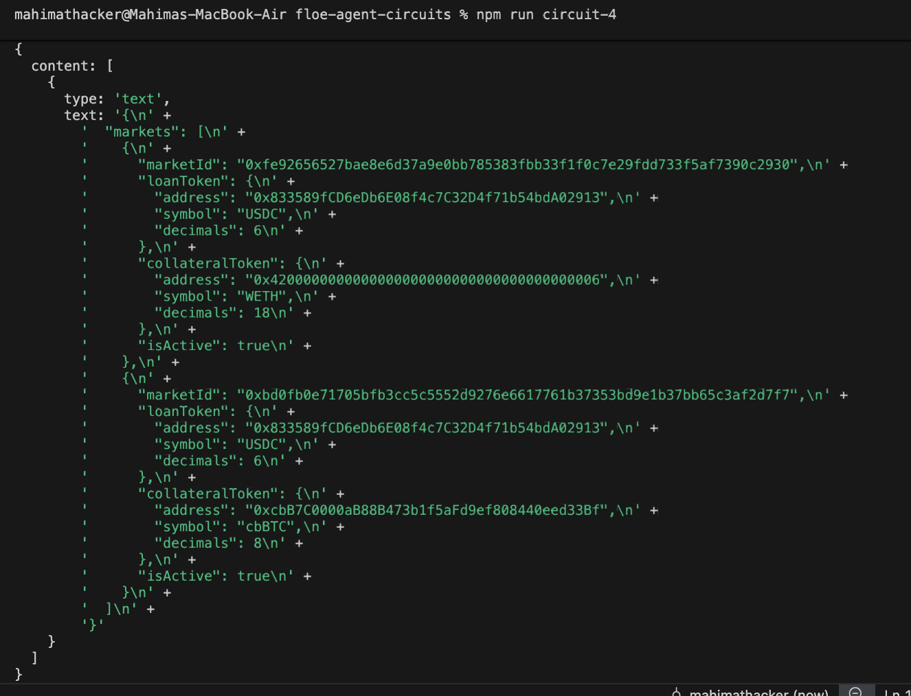

# Circuit 4: MCP Integration

A minimal client that talks to Floe's MCP server (`https://mcp.floelabs.xyz/mcp`) and calls the `get_markets` tool.

## Run

1. Add a Floe API key to `.env`:
   ```
   FLOE_API_KEY=floe_live_...
   ```
   (get one from https://dev-dashboard.floelabs.xyz)

2. Run:
   ```
   npm run circuit-4
   ```

## Result

The full circuit is ~10 lines of real logic — open transport, call tool, log result. End-to-end (install → key → first response) took only a few minutes, and the call itself returned in under a second.

The server returned the standard MCP envelope `{ content: [{ type: "text", text: "<json string>" }] }` with two markets: USDC/WETH and USDC/cbBTC.



## Notes

- **Docs snippet was outdated** — `new Client({ name })` and `client.callTool("name", {})` from the gitbook page no longer compile against the current `@modelcontextprotocol/sdk`. See [Finding #8](../docs/FINDINGS.md).
- **Mainnet-only** — the markets returned use Base mainnet token addresses, same gap as the REST API ([Finding #7](../docs/FINDINGS.md)).
- **Result is a JSON string, not parsed** — to use the data, do `JSON.parse(markets.content[0].text)`.
