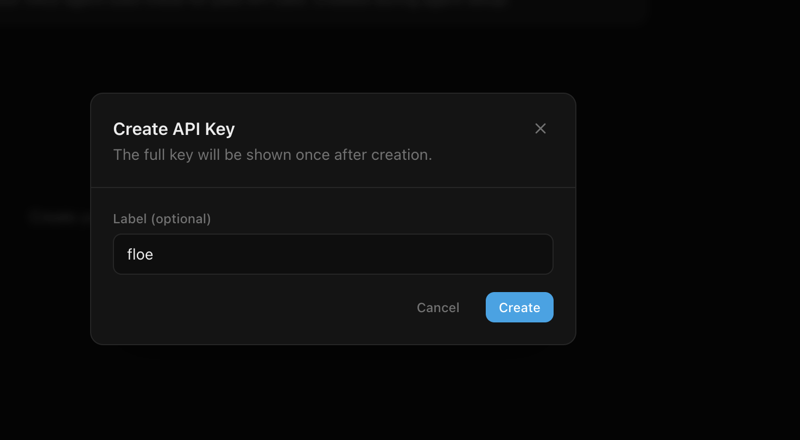

## FINDING #1: floe-agent package has broken dependencies
**Severity:** Critical - Blocks AgentKit integration
**What's broken:**
- `floe-agent` imports `@floe/credit-sdk` which doesn't exist on npm
- This makes `floe-agent` unusable out of the box

**Error:**
Cannot find package '@floe/credit-sdk' imported from
/node_modules/floe-agent/dist/creditClientAdapter.js

**Impact:**
- Developers cannot install and use floe-agent
- Blocks all AgentKit integration workflows

**Suggested fix:**
- Publish `@floe/credit-sdk` to npm
- OR bundle it within `floe-agent`
- OR update floe-agent to not require it

## Finding #2: Developer Dashboard UI Bug - API Key Label Input Loses Focus
**Severity:** Medium - Reduces UX quality

**Description:**
When creating an API key in the Developer Dashboard, the "Label (optional)" 
input field loses focus after typing a single character.

**Steps to Reproduce:**
1. Navigate to Developer Dashboard (dev-dashboard.floelabs.xyz)
2. Click "Create API Key" or equivalent button
3. Click into the "Label (optional)" text field
4. Type one character (e.g., "f")
5. Observe: cursor/focus disappears from the input field
6. Must click back into the field to type the next character

**Expected Behavior:**
Input should retain focus until user explicitly moves away (Tab key, click 
elsewhere, etc.)

**Actual Behavior:**
Focus is lost after every keystroke, requiring repeated clicks to type a 
multi-character label.

**Impact:**
- Frustrating user experience
- Slows down API key creation workflow
- May cause users to skip labeling keys entirely

**Likely Root Cause:**
React component re-rendering on every onChange event, causing input to 
lose controlled state. Common pattern:

```jsx
// Problematic code (example):
const [label, setLabel] = useState('');

// This causes re-render and focus loss:
<input value={label} onChange={(e) => setLabel(e.target.value)} />
```

**Suggested Fix:**
- Use useRef or uncontrolled component for the input
- OR ensure the parent component doesn't re-render on state change
- OR use React.memo() on the input component

**Environment:**
- Browser: Brave;
- OS: macOS
- Dashboard URL: dev-dashboard.floelabs.xyz
- Date: April 30, 2026

**Screenshot:**




## Finding #3: API Error Messages Could Be More Specific

**Issue:** NoLiquidityError doesn't indicate why matching failed

**Context:**
Attempted to borrow $10 USDC for 7 days, received:
```json
{
  "error": "NoLiquidityError",
  "message": "No matching lend intents for 10000000...",
  "closestOffers": [...]
}
```

**Root Cause Analysis:**
After querying `/v1/credit/offers`, discovered available liquidity exists 
($990 USDC available), but the request failed because:
- Requested duration: 7 days (604800 seconds)
- Required minimum: 21 days (1814400 seconds)

**The Issue:**
The error message says "no matching lend intents" but doesn't specify 
WHY they don't match. The developer must:
1. Query /v1/credit/offers separately
2. Manually compare their parameters against offer constraints
3. Identify which constraint caused the mismatch

**Impact:**
- Increases debugging time
- Could cause developers to think there's no liquidity at all
- Requires extra API call to diagnose

**Recommendation:**
Enhance error response to include constraint violations:

```json
{
  "error": "NoLiquidityError",
  "message": "No matching lend intents",
  "violations": [
    {
      "constraint": "minDuration",
      "requested": "604800",
      "required": "1814400",
      "message": "Duration too short. Available lenders require minimum 21 days."
    }
  ],
  "closestOffers": [...]
}
```

**Workaround:**
Always query `/v1/credit/offers` first to check available terms before 
calling `/v1/credit/instant-borrow`.

**Severity:** Medium - Impacts developer experience but has workaround

**Environment:**
- Network: Base Sepolia testnet
- MarketId: 0xfe92656527bae8e6d37a9e0bb785383fbb33f1f0c7e29fdd733f5af7390c2930
- API: credit-api.floelabs.xyz


## Finding #4: I could not figure out what `minLtvBps` does, and it kept blocking my borrow

**Severity:** High. This was the main thing that blocked my first borrow.

**What I saw:**

1. **The docs give a default but do not say what the field does.** The gitbook page for `/v1/credit/instant-borrow` lists the field as `"minLtvBps  string  No  Min LTV (default: 8000 = 80%)"`. That is all. The page does not say if it is a floor or a ceiling, if it applies to the borrower or the lender, or how it relates to the lender's `maxLtvBps`.

2. **Leaving `minLtvBps` out gives `NoLiquidityError` even when offers look like they should match.** With `minLtvBps` not set (so it uses the default of `8000`), this request was rejected:
   ```json
   POST /v1/credit/instant-borrow
   {
     "marketId": "0xfe92...2930",
     "borrowAmount":     "10000000",
     "collateralAmount": "20000000000000000",
     "maxInterestRateBps": "600",
     "duration": "2592000"
   }
   ```
   Response:
   ```json
   {
     "error": "NoLiquidityError",
     "closestOffers": [
       { "rate": 50,  "available": 5000000 },
       { "rate": 290, "available": 1000000000 },
       { "rate": 500, "available": 990000000 }
     ]
   }
   ```
   At least one of the closest offers (990 USDC at rate 500) is big enough, cheap enough, and long enough. So the failure is some other reason, probably LTV.

3. **Setting `minLtvBps` low did not help.** I tried `minLtvBps: "1"` (the lowest value the API accepts, since `"0"` is rejected). The same `NoLiquidityError` came back with the same close offers.

4. **The error does not say which rule failed.** `NoLiquidityError` plus a list of close offers reads like "there is no money to lend." It does not say if the failure was on size, rate, duration, borrower LTV, lender LTV, oracle price, or something else. A developer cannot tell which knob to turn next.

5. **Where the default comes from in the SDK:** `node_modules/floe-agent/dist/schemas.js`
   ```js
   minLtvBps: z.string().default("8000")
     .describe("Minimum LTV in basis points (default: 8000 = 80%).")
   ```
   The SDK only repeats the same short label as the docs.

**Workaround in the code:** [circuit-1-research-agent/index.ts](circuit-1-research-agent/index.ts:101-107) sends `minLtvBps: "1"`. This avoids the 400 from `"0"` but does not by itself produce a successful borrow.

**Open questions for Floe:**
1. Is there a minimum collateral value in USD I'm missing?
2. Can I get the oracle price the matcher uses? (To verify my LTV calculation)
3. Is there a way to see WHY each offer was rejected in the error response?
4. Why is minLtvBps defaulting to 8000 in the SDK? (Seems to reject most 
   natural over-collateralized positions)

**Environment:**
- Network: Base Sepolia
- Wallet: `0x8F669B63B3111C8C680Ddd87ea75518cEb860593` (`floe-circuit-1`)
- floe-agent version: 0.2.0
- Date: 2026-05-01


## Finding #5: The SDK and the REST API do not agree on what is valid

**Severity:** Medium. Easy to run into, slow to debug.

**Issue:** The rules in the `floe-agent` SDK and the rules the REST API enforces are not the same. A request that the SDK says is fine can still be rejected by the server.

**Examples I saw in this assignment:**

1. **`minLtvBps`: the SDK accepts any string, the API only accepts 1 to 10000.**
   - SDK: `minLtvBps: z.string().default("8000")` (no minimum, no maximum). See `node_modules/floe-agent/dist/schemas.js`.
   - API: returns `400 Invalid request body` with `"Must be between 1 and 10000"` when the request includes `"0"`.
   - So the SDK let me build a request with `"0"`. I sent it. The server for REST API returned an error

2. **The rule `maxLtvBps >= minLtvBps` is checked by the API but not by the SDK.**
   - Sending `minLtvBps: "10000"` without setting `maxLtvBps` returns `400 Invalid request body` with `"maxLtvBps must be >= minLtvBps"`.
   - The SDK does not check the two fields against each other, so a request that passes the SDK's type check can still fail once it reaches the server.

3. **The valid range and the cross-field rule are not in the public docs.** The gitbook page for `/v1/credit/instant-borrow` documents the default for `minLtvBps` (`"Min LTV (default: 8000 = 80%)"`) but does not list the valid range (`1` to `10000`) and does not mention the rule that `maxLtvBps` must be at least `minLtvBps`. The only way I learned these was by sending a request and reading the 400 response. Other fields probably have the same problem; I did not check them all.

**Why this matters:**

- A developer trusts the SDK types. Getting a 400 from the API after the SDK said the request was fine is confusing and slow to debug.
- Anyone who generates typed clients from the SDK (or from an OpenAPI spec, if Floe has one) will end up with clients that lie about what the API accepts.
- Rules that only show up in 400 responses are easy to miss until you trip over them, which slows down onboarding.

**Open questions for Floe:**
- Are there other cross-field rules (besides `maxLtvBps >= minLtvBps`) that the SDK does not check?
- Is there a single source of truth (OpenAPI spec, JSON schema, internal definition) that both the SDK and the API are meant to follow?

**Environment:**
- API: `credit-api.floelabs.xyz`
- SDK: `floe-agent` 0.2.0
- Date: 2026-05-01


## Finding #6: `floe-agent` npm package has no repository link

**Severity:** Low. Easy to fix, but it makes the package harder to trust and harder to file issues against.

The npm metadata for `floe-agent@0.2.0` does not include `repository`, `homepage`, or `bugs` fields. The published tarball is still visible on the npm "Code" tab, but there is no link to the canonical source repo (e.g. GitHub), no "Repository" or "Issues" entry in the npm sidebar, and `npm repo floe-agent` and `npm bugs floe-agent` do not work.

Adding `"repository"` and `"bugs"` blocks to `package.json` is a small change and would let users get to the source history, file issues, and contribute fixes.

**Environment:**
- Package: `floe-agent` 0.2.0 on npm
- Date: 2026-05-01


## Finding #7: There is no public REST API for Base Sepolia

**Severity:** High. Blocks anyone trying to run the quickstart on testnet.

The only documented Credit API URL is `https://credit-api.floelabs.xyz`. Calling `/v1/markets` returns markets whose token addresses are Base mainnet (USDC `0x833589...02913`, cbBTC `0xcbB7C0...33Bf`). There is no `/sepolia` path, no `X-Network` header, and no separate testnet host listed in the docs. So a developer with a funded Base Sepolia wallet cannot complete a borrow through the REST API, even though Floe deploys testnet contracts (matcher `0xF351...1B2E`, oracle `0x7102...03a5`).

Either a testnet REST endpoint should exist (and be documented), or the docs should clearly say the REST API is mainnet-only and point testnet users at on-chain calls.

**Environment:**
- API: `credit-api.floelabs.xyz`
- Date: 2026-05-01


## Finding #8: MCP server docs snippet does not compile against current `@modelcontextprotocol/sdk`

**Severity:** Low. Code copied straight from the docs fails to type-check.

The custom-agent example on https://floe-labs.gitbook.io/docs/developers/mcp-server uses an older shape of the MCP client SDK. Two issues against the current `@modelcontextprotocol/sdk`:

1. **`Client` constructor is missing `version`.** Docs show `new Client({ name: "my-defi-agent" })`, but the SDK's `Implementation` type requires both `name` and `version`. Result: `Property 'version' is missing in type '{ name: string; }'`.

2. **`callTool` is shown with positional args.** Docs show `client.callTool("get_markets", {})`, but the current SDK takes a single object: `client.callTool({ name: "get_markets", arguments: {} })`. Result: `Argument of type 'string' is not assignable to parameter of type '{ name: string; ... }'`.

Fix in the docs to:
```ts
const client = new Client({ name: "my-defi-agent", version: "1.0.0" });
const markets = await client.callTool({ name: "get_markets", arguments: {} });
```

**Environment:**
- Package: `@modelcontextprotocol/sdk` (latest at install time)
- Date: 2026-05-04
